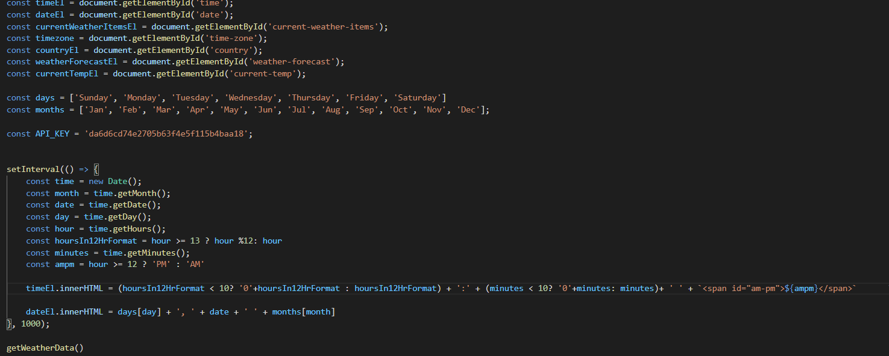

# zpl-weather-dashboard-1

## Description
  
  - What was my motivation? I wanted to make a Weather Dashboard application that fetches data from an API to get the current and upcoming weather in a user's location.
  - Why did I build this project? I wanted to create a weather application that gets me the forecast for the week in my location, and it works on mobile. 
  - What problem does it solve? It solves the problem of needing to look to a weather site for my current temperature when I can do it in my own application.
  - What did I learn? I learned how to fetch data from an API.
  - What makes my project stand out? Rather than present the user with a 5-day forecast, they are presented with a 7-day forecast.
  
# User Story
    AS A traveler
    I WANT to see the weather outlook for multiple cities
    SO THAT I can plan a trip accordingly

## Acceptance Criteria
    GIVEN a weather dashboard with form inputs
    WHEN I search for a city
    THEN I am presented with current and future conditions for that city and that city is added to the search history

    WHEN I view current weather conditions for that city
    THEN I am presented with the city name, the date, an icon representation of weather conditions, the temperature, the humidity, the wind speed, and the UV index

    WHEN I view the UV index
    THEN I am presented with a color that indicates whether the conditions are favorable, moderate, or severe

    WHEN I view future weather conditions for that city
    THEN I am presented with a 5-day forecast that displays the date, an icon representation of weather conditions, the temperature, the wind speed, and the humidity

    WHEN I click on a city in the search history
    THEN I am again presented with current and future conditions for that city
  ## Table of Contents
  
  - [Description](#description)
  - [Credits](#credits)
  - [License](#license)

  ## Usage

  
  
  ## Credits

  I followed this [tutorial](https://www.youtube.com/watch?v=6trGQWzg2AI) for help on implementing the OneCall API.
  ## License

  No license.

  ---

  ## Questions?
  If you have any questions, check out my [GitHub profile](https://github.com/zachary-levin) at or email me at [zlevin706@gmail.com](mailto:zlevin706@gmail.com)
